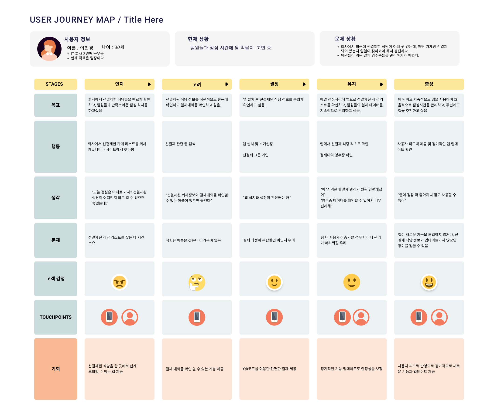
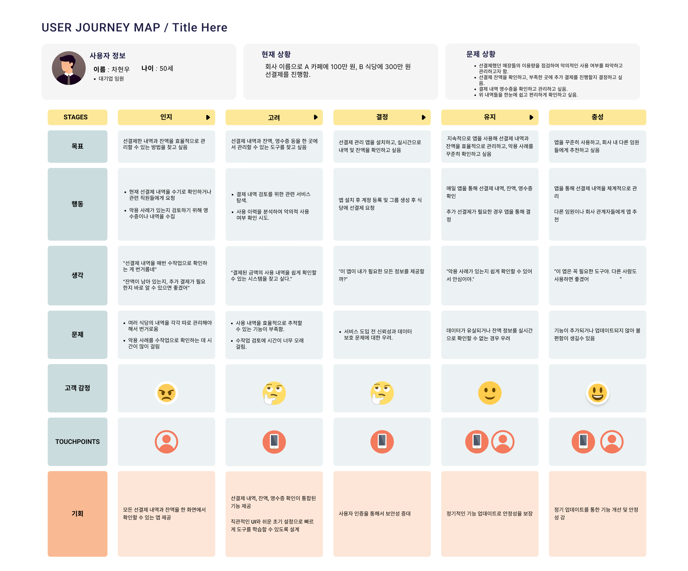
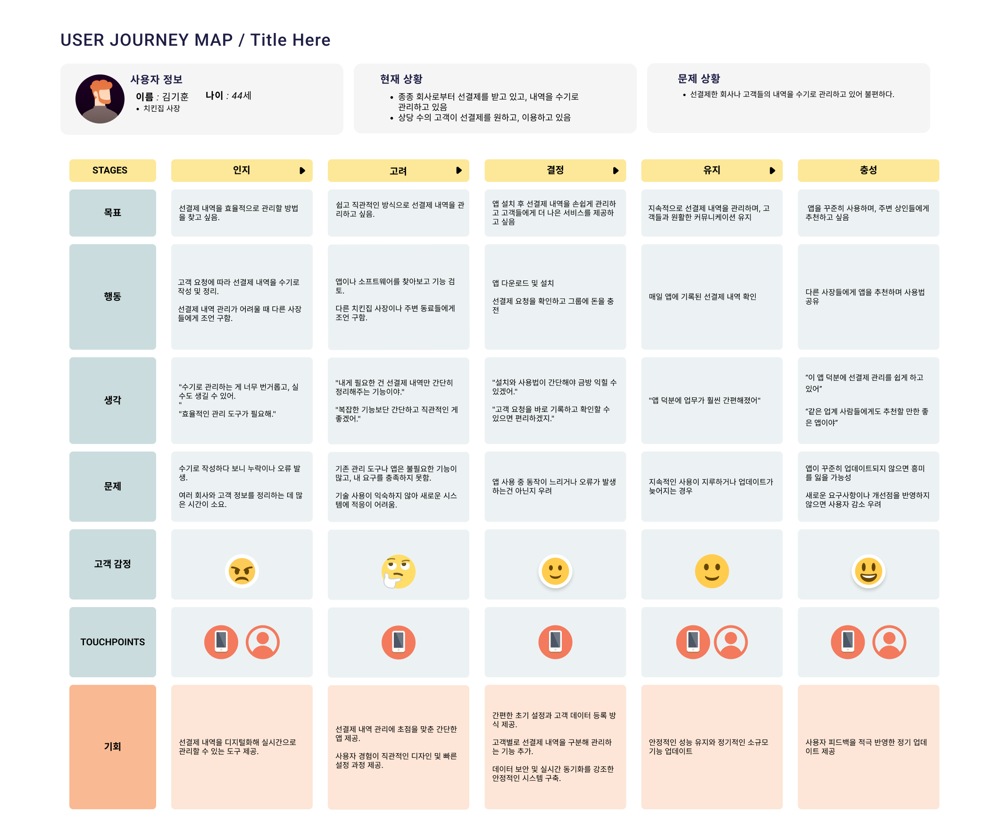
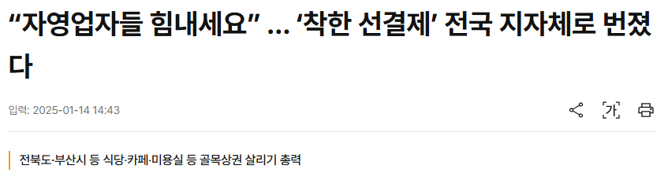
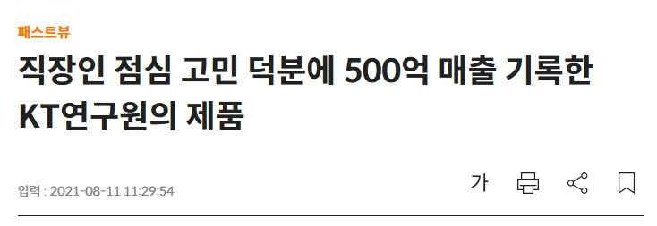
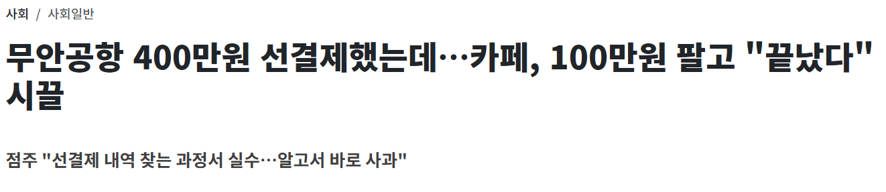
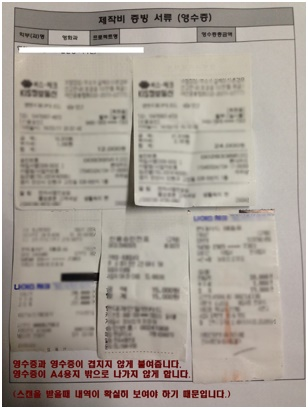
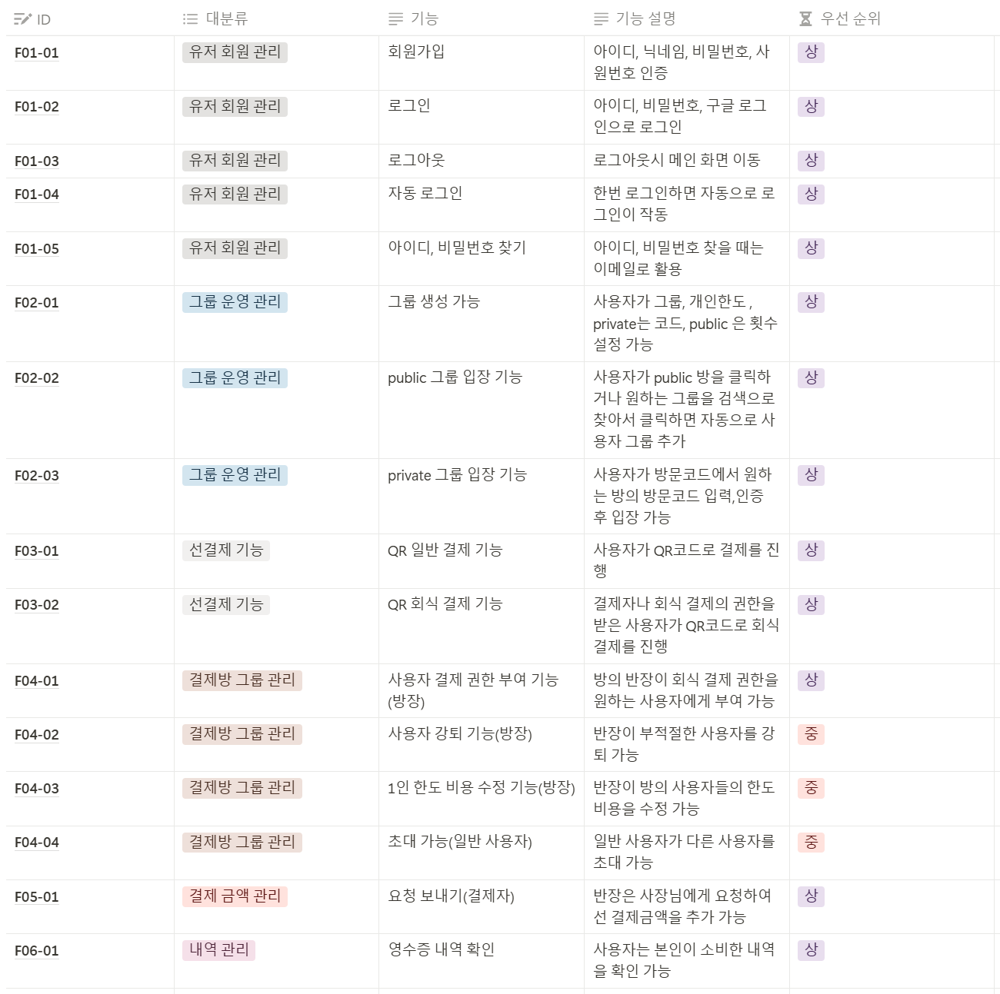
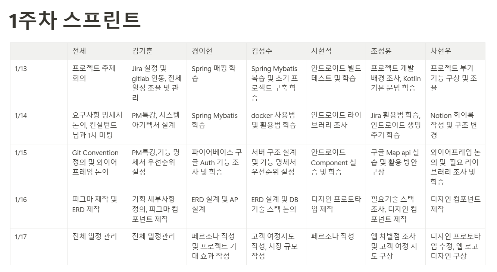

## 0) 소개

## 1) 페르소나

| 이름 | dwer |
| --- | --- |
| 인적사항 | 25세, 봉사활동 유튜버, 여자 |
| 현재 상황 | 봉사를 나온 사람들을 위해 카페에서 음료수 한 잔씩 구매할 수 있도록 기부 하고 싶음 |
| 문제 상황 | - 가게 사장이 선결제한 내역을 잘 이행하고 있는지 확인하고 싶다. - 다른 사람들에게 선결제한 사실을 알리고 싶다.  |

| 이름 | 경이현 |
| --- | --- |
| 인적사항 | 30세, IT 회사 근무 3년차(직책: 팀장),  남자 |
| 현재 상황 | 점심 시간에 뭘 먹을지 고민 중 |
| 문제 상황 | - 회사에서 최근에 선결제한 식당이 여러 곳 있는데, 어떤 가게랑 선결제 되어 있는지 일일이 찾아봐야 해서 불편하다. - 팀원들이 먹은 결제 영수증들을 관리하기가 어렵다.  |

| 이름 | 차현우 |
| --- | --- |
| 인적사항 | 50세,  대기업 임원, 남자 |
| 현재 상황 | 회사이름으로 A 카페에 100만원, B식당에 300만원 선결제를 함 |
| 문제 상황 | - 선결제한 식당들의 결제 내역을 확인하고 악의적으로 사용하는 사람이 있는지 검토하고 싶다. - 선 결제 잔액을 확인하고, 부족한 곳에 선결제를 더 진행할지 아닐지 결정하고 싶다. - 위 내역들을 한 눈에 쉽고, 편하게 확인하고 싶다. - 결제내역 영수증을 확인하고 관리하고 싶다. |

| 이름 | 김기훈 |
| --- | --- |
| 인적사항 | 44세,  치킨집 사장, 남자 |
| 현재 상황 | - 많은 회사가 인접해 있고, 상당 수의 고객이 회사원 - 종종 회사로부터 선결제를 받고 있고, 내역을 수기로 관리하고 있음 - 상당 수의 고객이 선결제를 원하고, 이용하고 있음 |
| 문제 상황 | - 선결제한 회사나 고객들의 내역을 수기로 관리하고 있어 불편하다. |

## 2) 고객여정지도

## 3) 시장 조사

- 식권 스타트업 식신 한달 **선결제 규모가 10억원**인데 향후 늘려나갈 계획(고려대 선결제 앱)
- 중소벤처기업부가 **214개 식당·7700만원**, 11개 공공기관이 **622개 식당·1억7200만원을 선결제**(선결제는 정말 착할까)
- 식신 E-식권 서비스는 론칭한 지 6년 만에 **500억 원 이상의 매출액**을 기록했다(직장인 점심 고민 덕분에 500억 매출 기록한 KT연구원의 제품)
- 2020년 **푸드테크 시장의 규모는 20조 원**대로 추정된다. 미래 성장 가능성이 매우 크며, 지속가능한 산업 분야 중 하나로 평가(직장인 점심 고민 덕분에 500억 매출 기록한 KT연구원의 제품)
- 정치·시사 유튜버가 카페에 두 차례에 걸쳐 100만 원, 300만 원을 선결제했는데, 자원봉사자가 커피를 달라고 했더니 카페 직원이 '100만 원어치 결제한 게 다 끝났다'는 말만(무안공항 선결제 기사)

### 기사 스크랩

## 4) 차별점

- 영수증을 제공해주는 기능
- 모임원 모두 결제 내역을 확인하게 해주는 기능
- public 선결제 모임을 지원하는 기능(무안공항, 시위 선결제 같은 예시)
- POS와 연결되어 정보를 주고 받는 기능

**장점**

- 회사에서 관리가 용이
- 결제를 했을 때 결제내역 확인 가능
- 돈의 소비를 자유롭게 정할 수 있음
- POS 연동이 되어 결제가 간편, 결제 시스템의 자동화
- 수기로 관리하여 불편하던 점이 해결
- **기부 선결제**를 안전하고 투명하게 진행할 수 있음

## 5) 기대 효과

# 🥇Jira Sprint

## Step1. Sub-PJT 1

1. 프로젝트 주제 정하기**✅**
2. 페르소나 설정, 고객 여정 지도, 시장 조사, 차별 점 ,기대 효과**✅**
3. Jira 설정 및 Gitlab 연결**✅**
4. 요구 사항 명세서 작성**✅**
5. Wire Frame 제작(Figma)**✅**
6. ERD 설계**✅**
7. 개인 별 학습 및 라이브러리 조사**✅**

## 🥈 요구 사항 명세서(기능 명세서)

# 🏅 1주차 스프린트

